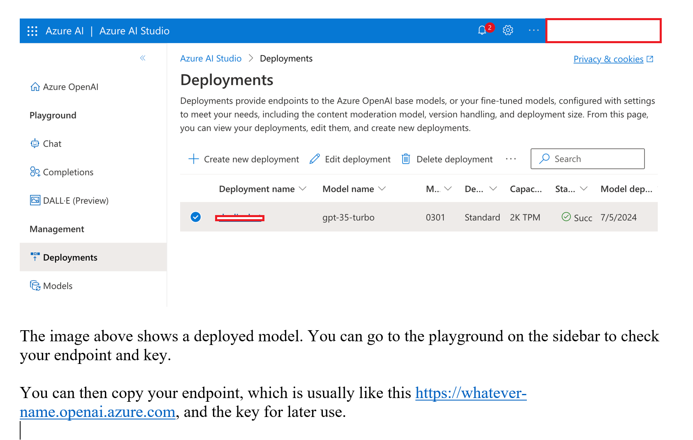

# dotnet run error

```sh
@svedanie ➜ SemanticKernelDemo git(main) dotnet run
Unhandled exception. Microsoft.SemanticKernel.Diagnostics.HttpOperationException: The API deployment for this resource does not exist. If you created the deployment within the last 5 minutes, please wait a moment and try again.
Status: 404 (Not Found)
ErrorCode: DeploymentNotFound

Content:
{"error":{"code":"DeploymentNotFound", "message":"The API deployment for this resource does not exist. If you created the deployment within the last 5 minutes, please wait a moment and try again."}}

Headers:
OpenAI-Processing-Ms: REDACTED
x-ms-client-request-id: 728bfeb1-e9b4-4e8b-b67a-0bd53d69162a
apim-request-id: REDACTED
Strict-Transport-Security: REDACTED
X-Content-Type-Options: REDACTED
x-ms-region: REDACTED
Date: Tue, 10 Oct 2023 19:25:24 GMT
Content-Length: 198
Content-Type: application/json
```

## retry 1

Tried to remove trailing slash from API endpoint, did not work

From: `https://sveinopenaitest.openai.azure.com/`, To: `https://sveinopenaitest.openai.azure.com`

## retry 2

I changed `dotnet user-secrets set "AzureOpenAI:ChatCompletionDeploymentName" "gpt-35-turbo"` to `dotnet user-secrets set "AzureOpenAI:ChatCompletionDeploymentName" "sveinchat"`

Needs to be specified that we need to use the deployment name for the deployment we made in Azure OpenAI Studio

### comment



this image shows the Azure AI Studio, but the key and endpoint is located in Azure Portal? Somewhat unclear

# SK plugin

work great!
